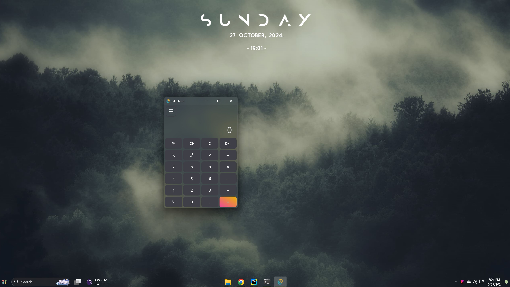
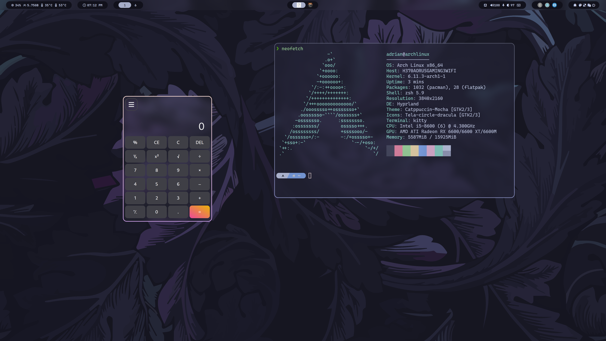

# Tauri Calculator

A simple calculator application **built using Tauri, React, and Rust**. This app allows users to perform basic arithmetic calculations with a desktop-friendly interface, supporting keyboard inputs and mouse interactions.
Tauri acts as the bridge, allowing the React app to invoke Rust functions for mathematical expression evaluation. Unlike Electron, which uses Chromium, Tauri relies on the platform's native webview, resulting in a smaller app size and better performance.

## Features

- **Basic Operations**: Addition, subtraction, multiplication, division, modulus.
- **Additional Functions**: Square, square root, reciprocal calculation, and sign toggling.
- **Keyboard Support**: Allows using the keyboard for number entry and operations.
- **Interactive Buttons**: Responsive calculator buttons for mouse interaction.
- **Cross-Platform**: Supports macOS, Windows, and Linux.
- **Modern UI**: Vibrancy effect on macOS, acrylic effect on Windows, and blurred background on Linux for a sleek appearance.

## Screenshots

| windows 11 | arch hyprland linux | macos
| :---:      | :---:         | :---:      
|  |  |  |

### Notes
Bad performance when resizing/dragging the window on Windows 10 v1903+ and Windows 11 build 22000.
